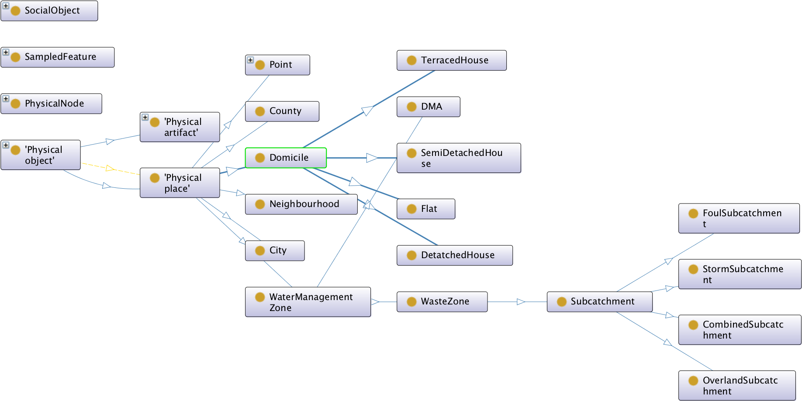

# Ontology

Ontology, Semantic Web, Domains 

## socio

1. water [purl](http://purl.org/socio/water)

## water

1. wsn [purl](http://purl.org/water/wsn)
1. lake [purl](http://purl.org/water/lake)

# W3C

**WISDOM Project [link](http://www.semanticwater.com/#resources)**

1. WISDOM-Object.Agent
   
1. WISDOM-Object.Physical Object
   
1. WISDOM-Object.SocialObject
   
